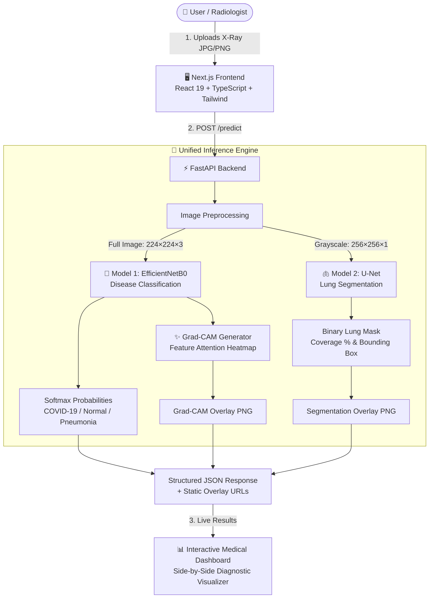

# Chest X-Ray AI Analysis System

> **A production-quality full-stack medical imaging application combining deep-learning disease classification, anatomical lung segmentation, Grad-CAM explainability, a FastAPI Python backend, and a modern Next.js TypeScript frontend.**

[](https://nextjs.org/)
[](https://react.dev/)
[](https://www.typescriptlang.org/)
[](https://tailwindcss.com/)
[](https://fastapi.tiangolo.com/)
[](https://www.tensorflow.org/)
[](https://vercel.com/)
[-lightgrey)](#no-docker--no-aws-statement)

---

## Table of Contents

- [1. System Architecture](#1-system-architecture)
- [2. Machine Learning Foundations](#2-machine-learning-foundations)
  - [2.1 Classification Pipeline (EfficientNetB0)](#21-classification-pipeline-efficientnetb0)
  - [2.2 Lung Segmentation Pipeline (U-Net)](#22-lung-segmentation-pipeline-u-net)
  - [2.3 Model Explainability (Grad-CAM)](#23-model-explainability-grad-cam)
  - [2.4 Confidence Policy](#24-confidence-policy)
- [3. Full-Stack Application Structure](#3-full-stack-application-structure)
- [4. Frontend Implementation (Next.js)](#4-frontend-implementation-nextjs)
- [5. Backend Implementation (FastAPI)](#5-backend-implementation-fastapi)
- [6. API Contract & Endpoints](#6-api-contract--endpoints)
  - [6.1 Health Endpoint (`GET /health`)](#61-health-endpoint-get-health)
  - [6.2 Prediction Endpoint (`POST /predict`)](#62-prediction-endpoint-post-predict)
  - [6.3 Visualization Files (`GET /visualizations/{filename}`)](#63-visualization-files-get-visualizationsfilename)
- [7. Environment Configuration](#7-environment-configuration)
- [8. Local Setup & Execution](#8-local-setup--execution)
  - [8.1 Backend Setup](#81-backend-setup)
  - [8.2 Frontend Setup](#82-frontend-setup)
- [9. Testing & Validation](#9-testing--validation)
- [10. Vercel Frontend Deployment](#10-vercel-frontend-deployment)
- [11. FastAPI Backend Deployment Considerations](#11-fastapi-backend-deployment-considerations)
- [12. No Docker & No AWS Statement](#12-no-docker--no-aws-statement)
- [13. Troubleshooting & FAQ](#13-troubleshooting--faq)
- [14. Medical & Research Disclaimer](#14-medical--research-disclaimer)

---

## 1. System Architecture

### 1.1 Simple Pipeline Diagram



### 1.2 Component Architecture

```
                            ┌───────────────────────────────────┐
                            │               USER                │
                            └─────────────────┬─────────────────┘
                                              │
                                              ▼
                            ┌───────────────────────────────────┐
                            │         NEXT.JS FRONTEND          │
                            │   React 19 • TypeScript • Tailwind │
                            │     Deploy Target: Vercel         │
                            └─────────────────┬─────────────────┘
                                              │
                                              │ HTTP POST /predict (multipart/form-data)
                                              ▼
                            ┌───────────────────────────────────┐
                            │          FASTAPI BACKEND          │
                            │   Python API • Pydantic V2 • CORS │
                            └─────────────────┬─────────────────┘
                                              │
                                              ▼
                            ┌───────────────────────────────────┐
                            │     Unified Inference Engine      │
                            │   src/unified_inference.py        │
                            └─────────┬───────────────┬─────────┘
                                      │               │
                                      ▼               ▼
                       ┌──────────────────────┐ ┌──────────────────────┐
                       │   EfficientNetB0     │ │        U-Net         │
                       │   Classification     │ │     Segmentation     │
                       │   (Full Radiograph)  │ │ (256×256 Grayscale)  │
                       └──────────────┬───────┘ └──────────┬───────────┘
                                      │                    │
                                      ▼                    ▼
                                 Prediction            Lung Mask
                                      │             Coverage % & BBox
                                      ▼                    │
                                   Grad-CAM                │
                                 Explainability            │
                                      │                    │
                                      └──────────┬─────────┘
                                                 │
                                                 ▼
                                     Static Overlay PNGs &
                                    Structured JSON Response
                                                 │
                                                 ▼
                                     Next.js Medical Dashboard
```

---

## 2. Machine Learning Foundations

> **IMPORTANT**: The machine-learning models, weights, and unified inference logic are completed, verified, and locked. The models are loaded lazily once and kept persistently in memory across requests.

### 2.1 Classification Pipeline (EfficientNetB0)
- **Model File**: `models/classification/best_finetuned_efficientnetb0.keras` (~38 MB)
- **Architecture**: Fine-tuned EfficientNetB0 backbone with top dropout and dense softmax head.
- **Input Format**: Full chest X-ray image resized to `224 × 224 × 3`.
- **Target Classes**:
  1. `covid` (Index `0`)
  2. `normal` (Index `1`)
  3. `pneumonia` (Index `2`)
- **Key Design Decision**: The classifier receives the **full, unsegmented chest X-ray**. It is **not** fed a cropped lung ROI. Empirical tests confirmed that feeding cropped lung ROIs into the classifier introduces an out-of-distribution domain shift. The full field provides essential peripheral diagnostic context.

### 2.2 Lung Segmentation Pipeline (U-Net)
- **Model File**: `models/segmentation/best_unet.keras` (~93 MB)
- **Architecture**: 2D U-Net encoder-decoder with skip connections.
- **Input Format**: Grayscale chest X-ray resized to `256 × 256 × 1` and normalized to `[0.0, 1.0]`.
- **Output**: Continuous lung probability mask thresholded at `0.5` to generate a binary lung mask.
- **Computed Metrics**:
  - **Lung Area Coverage**: Percentage of total radiograph area occupied by segmented lung fields.
  - **Bounding Box**: Anatomical coordinates (`x_min`, `y_min`, `x_max`, `y_max`, `width`, `height`).
  - **Lung ROI Shape**: Dimensions of the bounding box slice.
- **Overlay**: Rendered as a distinct green anatomical overlay mask (`{request_id}_segmentation.png`).

### 2.3 Model Explainability (Grad-CAM)
- **Target Layer**: `top_conv` (final convolutional layer of the EfficientNetB0 backbone before classification head pooling).
- **Target Class**: Backpropagated from the winning predicted class logit.
- **Heatmap Shape**: `7 × 7` feature resolution scaled and blended using OpenCV Jet colormap.
- **Overlay**: Blended transparently with the original radiograph (`{request_id}_gradcam.png`).
- **Critical Clinical Distinction**:
  - **Grad-CAM** represents the classifier's feature attribution attention map.
  - **Grad-CAM is NOT a lung segmentation mask**, and highlighted regions do not represent absolute biological disease margins.

### 2.4 Confidence Policy
Defined in `configs/classification_confidence_policy.json`:
- **LOW** (`confidence < 0.70`): Significant uncertainty. Must be interpreted cautiously.
- **MODERATE** (`0.70 <= confidence < 0.90`): Meaningful uncertainty. Expert radiologist review advised.
- **HIGH** (`confidence >= 0.90`): Strong statistical certainty. Does not guarantee clinical accuracy.

---

## 3. Full-Stack Application Structure

```text
chest_xray_api/
│
├── api/                                  # FastAPI Application
│   ├── __init__.py
│   ├── main.py                           # App entry point, CORS, upload validation, endpoints
│   ├── schemas.py                        # Pydantic V2 request & response schemas
│   └── temp_uploads/                     # Ephemeral upload buffer (auto-cleaned after inference)
│
├── configs/                              # Pipeline Configuration Files
│   ├── classification_confidence_policy.json
│   └── classification_gradcam_config.json
│
├── models/                               # Locked Neural Network Weights
│   ├── classification/
│   │   └── best_finetuned_efficientnetb0.keras
│   └── segmentation/
│       └── best_unet.keras
│
├── src/                                  # Core Python Inference Engine
│   └── unified_inference.py              # analyze_chest_xray() pipeline
│
├── generated_visualizations/             # Output directory for static overlay PNGs
│   ├── {uuid}_gradcam.png
│   └── {uuid}_segmentation.png
│
├── tests/                                # Test Suites
│   ├── test_api_endpoints.py             # Pytest endpoint, CORS, validation, and inference tests
│   └── test_full_pipeline_e2e.py         # End-to-end user journey simulation
│
├── frontend/                             # Next.js Full-Stack Web Application
│   ├── app/
│   │   ├── layout.tsx                    # Root layout with fonts, metadata, accessibility tags
│   │   ├── page.tsx                      # Master client-side state machine (upload, dashboard)
│   │   └── globals.css                   # Tailwind CSS styling and theme tokens
│   │
│   ├── components/                       # Modular UI Components
│   │   ├── Header.tsx                    # Branding, navigation, and live API status badge
│   │   ├── Hero.tsx                      # Project overview and pipeline architecture highlights
│   │   ├── UploadZone.tsx                # Drag-and-drop file upload with format/size validation
│   │   ├── ImagePreview.tsx              # Radiograph preview with replace/remove controls
│   │   ├── AnalysisButton.tsx            # Submit action button with loading spinners
│   │   ├── LoadingState.tsx              # Multi-stage neural network progress card
│   │   ├── ResultsDashboard.tsx          # Master post-inference results view
│   │   ├── ClassificationResult.tsx      # Diagnosis card, confidence score, and policy notes
│   │   ├── ProbabilityChart.tsx          # Softmax bar chart for COVID-19, Normal, Pneumonia
│   │   ├── ConfidenceBadge.tsx           # Accessible badge colored by confidence category
│   │   ├── SegmentationResult.tsx        # U-Net lung coverage % and bounding box metrics
│   │   ├── GradCAMResult.tsx             # Model explainability card with attribution details
│   │   ├── VisualizationsGallery.tsx     # Side-by-side: Original vs. Segmentation vs. Grad-CAM
│   │   ├── TechnicalDetails.tsx          # Collapsible JSON payload inspector
│   │   ├── ErrorMessage.tsx              # User-friendly error alert with retry button
│   │   ├── MedicalDisclaimer.tsx         # Clinical safety and research notice
│   │   ├── HowItWorks.tsx                # 5-stage pipeline walkthrough
│   │   ├── About.tsx                     # Technical rationale and design decisions
│   │   └── Footer.tsx                    # Architecture summary and repository links
│   │
│   ├── lib/                              # Frontend Client Utilities
│   │   ├── api.ts                        # Centralized fetch client, health check, URL builder
│   │   ├── types.ts                      # Strict TypeScript interfaces mirroring backend schemas
│   │   └── utils.ts                      # Class merging (cn) and formatting helpers
│   │
│   ├── .env.example                      # Frontend environment variable template
│   ├── .env.local                        # Local development environment configuration
│   ├── next.config.ts                    # Next.js config with remote image patterns
│   ├── package.json                      # Frontend dependencies
│   └── tsconfig.json                     # Strict TypeScript compiler options
│
├── 0a7faa2a.png                          # Sample test radiograph
├── validate_static_visualizations.py     # Static visualization verification script
├── requirements.txt                      # Python backend dependencies
└── README.md                             # Complete project documentation
```

---

## 4. Frontend Implementation (Next.js)

The frontend is constructed using the **Next.js 15+ App Router**, **React 19**, **TypeScript**, and **Tailwind CSS**.

### Key Frontend Features
- **Zero Mock Data**: Renders live inference results delivered by the FastAPI backend.
- **Centralized API Client** (`frontend/lib/api.ts`):
  - Uses `NEXT_PUBLIC_API_BASE_URL` to route requests.
  - Generates absolute URLs for static overlays hosted on the backend.
  - Includes request abort timeouts and descriptive error translation.
- **Strict TypeScript Types** (`frontend/lib/types.ts`):
  - Strictly models all Pydantic schemas (`PredictionResponse`, `ClassificationResult`, `SegmentationResult`, `GradCamResult`, `VisualizationsResult`).
  - No `any` or loose typing.
- **Client-Side Validation**:
  - Validates MIME types (`image/jpeg`, `image/png`) and file extensions (`.jpg`, `.jpeg`, `.png`).
  - Enforces a 15MB file size ceiling before sending bytes across the network.
- **Responsive & Accessible Design**:
  - Fluid mobile-first grid supporting desktop, tablet, and mobile viewports.
  - WCAG-compliant contrast ratios, ARIA progress bars, accessible badges, and keyboard navigation.
- **Comparative Visualizations**:
  - Interactive multi-tab or side-by-side gallery displaying the original radiograph, green U-Net lung segmentation mask, and Jet colormap Grad-CAM activation overlay with direct high-resolution PNG inspection links.

---

## 5. Backend Implementation (FastAPI)

The backend exposes a high-performance, asynchronous REST API built on FastAPI.

### Improvements & Enhancements
1. **Configurable Cross-Origin Resource Sharing (CORS)**:
   - Configurable via `ALLOWED_ORIGINS` environment variable (defaults to `http://localhost:3000,http://127.0.0.1:3000`).
   - Dynamic regex matching supports all localhost development ports and Vercel preview/production domains (`https://*.vercel.app`).
2. **Strict Pydantic V2 Serialization**:
   - Every endpoint is governed by structured Pydantic response models (`PredictionResponse`, `HealthResponse`), providing type validation and auto-generated Swagger UI documentation at `/docs`.
3. **Upload Security & Integrity Checks**:
   - Enforces 15MB payload size limits in streamed chunks.
   - Decodes image bytes via OpenCV to ensure the payload is a valid, uncorrupted radiograph before calling inference.
4. **Filesystem Sanitization**:
   - Ephemeral upload files are stored under randomized UUID filenames and unconditionally unlinked in a `finally:` block.
   - Internal server paths are omitted from client-facing responses, returning a clean `request_id` and sanitized `filename`.
5. **Static File Serving**:
   - Mounts `/visualizations` on `generated_visualizations/` via `StaticFiles` to serve generated Grad-CAM and segmentation overlays directly.

---

## 6. API Contract & Endpoints

### 6.1 Health Endpoint (`GET /health`)
Verifies service availability without triggering expensive model execution.

**Response (`200 OK`)**:
```json
{
  "status": "healthy",
  "unified_inference": "available",
  "version": "1.0.0"
}
```

### 6.2 Prediction Endpoint (`POST /predict`)
Accepts a single radiograph via `multipart/form-data`.

**Request**:
- **Field**: `file` (Binary image file: JPG, JPEG, or PNG, max 15MB)

**Response (`200 OK`)**:
```json
{
  "success": true,
  "result": {
    "request_id": "6075494c-e832-4302-a23e-026190f96ad1",
    "filename": "chest_xray_test.png",
    "classification": {
      "predicted_class": "covid",
      "predicted_label": 0,
      "confidence": 0.9999064207077026,
      "confidence_category": "high",
      "class_probabilities": {
        "covid": 0.9999064207077026,
        "normal": 4.877864197624149e-05,
        "pneumonia": 4.475988316698931e-05
      }
    },
    "segmentation": {
      "lung_coverage": 0.255823029366306,
      "bounding_box": {
        "x_min": 43,
        "x_max": 587,
        "y_min": 240,
        "y_max": 625,
        "width": 545,
        "height": 386
      },
      "lung_roi_shape": [386, 545]
    },
    "gradcam": {
      "predicted_class": "covid",
      "target_class": "covid",
      "confidence": 0.9999064207077026,
      "heatmap_shape": [7, 7]
    },
    "visualizations": {
      "gradcam_overlay_url": "/visualizations/6075494c-e832-4302-a23e-026190f96ad1_gradcam.png",
      "segmentation_overlay_url": "/visualizations/6075494c-e832-4302-a23e-026190f96ad1_segmentation.png"
    }
  }
}
```

### 6.3 Visualization Files (`GET /visualizations/{filename}`)
Direct URL to download or display generated PNG overlay files.

---

## 7. Environment Configuration

### Frontend (`frontend/.env.local`)
Create a `.env.local` file inside the `frontend/` directory:

```bash
# FastAPI backend base URL
NEXT_PUBLIC_API_BASE_URL=http://localhost:8000
```

### Backend (`.env` or Shell Environment)
Optional backend environment variables:

```bash
# Comma-separated list of allowed CORS origins
ALLOWED_ORIGINS=http://localhost:3000,http://127.0.0.1:3000,https://your-app.vercel.app
```

---

## 8. Local Setup & Execution

### 8.1 Backend Setup

1. **Prerequisites**: Python 3.10 or 3.11.
2. **Create and Activate Virtual Environment**:
   ```bash
   # Windows (PowerShell)
   python -m venv .venv
   .\.venv\Scripts\Activate.ps1

   # Linux / macOS
   python3 -m venv .venv
   source .venv/bin/activate
   ```
3. **Install Dependencies**:
   ```bash
   pip install -r requirements.txt
   ```
4. **Start the FastAPI Server**:
   ```bash
   uvicorn api.main:app --reload --host 0.0.0.0 --port 8000
   ```
   The backend will be live at `http://localhost:8000`. Interactive Swagger UI is available at `http://localhost:8000/docs`.

### 8.2 Frontend Setup

1. **Prerequisites**: Node.js 18+ (Node 20+ or 24 recommended).
2. **Navigate to the frontend directory**:
   ```bash
   cd frontend
   ```
3. **Install Dependencies**:
   ```bash
   npm install
   ```
4. **Run the Development Server**:
   ```bash
   npm run dev
   ```
   Open `http://localhost:3000` in your web browser.

---

## 9. Testing & Validation

The project includes automated test suites covering endpoints, CORS headers, image validation, and end-to-end inference.

### Run Backend Pytest Suite:
```bash
.\.venv\Scripts\pytest tests/ -v
```

**Validated Test Cases**:
- `test_root_endpoint`: Verifies API index route and docs link.
- `test_health_endpoint`: Verifies lightweight health check.
- `test_cors_headers`: Verifies CORS response headers for browser clients.
- `test_predict_unsupported_file_extension`: Asserts rejection of non-image file types (`.txt`).
- `test_predict_corrupted_image`: Asserts rejection of unreadable byte payloads.
- `test_predict_valid_sample_image`: Validates full inference pipeline using `0a7faa2a.png`.
- `test_full_pipeline_integration`: Simulates full frontend journey and static visualization downloads.

### Run Frontend Type Check & Production Build:
```bash
cd frontend
npm run build
```

---

## 10. Vercel Frontend Deployment

The Next.js frontend is fully compatible with Vercel deployment:

1. Push your repository to GitHub (`https://github.com/CodeClosed/Cloud-Project`).
2. Log in to [Vercel](https://vercel.com) and click **Add New Project**.
3. Select the repository `Cloud-Project`.
4. Set **Root Directory** to `frontend`.
5. Under **Environment Variables**, add:
   - **Key**: `NEXT_PUBLIC_API_BASE_URL`
   - **Value**: The public URL of your deployed FastAPI backend (e.g., `https://api.yourdomain.com`).
6. Click **Deploy**.

Vercel will compile the Next.js App Router application and deploy it to a global edge network.

---

## 11. FastAPI Backend Deployment Considerations

Because the backend relies on heavy Python machine learning libraries (TensorFlow, OpenCV, NumPy) and persistent GPU/CPU models, it should be deployed on a standard Python hosting platform rather than Vercel serverless functions:

- **Recommended Platforms**:
  - [Render](https://render.com/) (Web Service with Python environment)
  - [Railway](https://railway.app/)
  - [Fly.io](https://fly.io/)
  - Dedicated Cloud Virtual Machine (Ubuntu VPS, Compute Engine, etc.)
- **Persistent Storage**:
  - In a multi-instance production environment, the `generated_visualizations` directory can be backed by a shared persistent volume or object storage (e.g. S3-compatible bucket or Cloud Storage) if long-term image retention is required.
- **CORS Configuration**:
  - Set `ALLOWED_ORIGINS=https://your-vercel-deployment.vercel.app` in the backend environment.

---

## 12. No Docker & No AWS Statement

In accordance with strict project constraints:
- **No Docker**: There are **no Dockerfiles**, **no docker-compose files**, and **no container-based abstractions**. The application runs directly using standard Python virtual environments and Node.js package managers.
- **No AWS**: No AWS-specific services, SDKs, or cloud architecture dependencies have been added.

---

## 13. Troubleshooting & FAQ

### 1. `API Offline (Retry)` badge in frontend header
- Ensure the FastAPI server is running on port 8000:
  ```bash
  uvicorn api.main:app --reload --port 8000
  ```
- Check that `NEXT_PUBLIC_API_BASE_URL=http://localhost:8000` is present in `frontend/.env.local`.

### 2. Browser CORS Error
- If running frontend on a non-standard port (e.g. `http://localhost:3001`), add that origin to `ALLOWED_ORIGINS`:
  ```bash
  $env:ALLOWED_ORIGINS="http://localhost:3000,http://localhost:3001"
  uvicorn api.main:app --reload
  ```

### 3. First inference request takes longer
- The deep learning models (`EfficientNetB0` and `U-Net`) load lazily upon the very first request. Subsequent requests execute rapidly from memory cache.

---

## 14. Medical & Research Disclaimer

> [!WARNING]
> **RESEARCH & EDUCATIONAL USE ONLY**
>
> 1. This system is designed solely as an artificial intelligence research proof-of-concept and educational software demonstration.
> 2. It has **not** been cleared, approved, or evaluated by the United States Food and Drug Administration (FDA), European Medicines Agency (EMA), or any other regulatory authority.
> 3. This software **is not a diagnostic medical device** and must **not** be used for clinical diagnosis, patient screening, triage, or clinical decision support.
> 4. Model predictions, confidence categories, lung segmentations, and Grad-CAM activation maps are probabilistic machine approximations that can produce false positives and false negatives. Always consult a qualified licensed physician or board-certified radiologist for medical evaluation.
