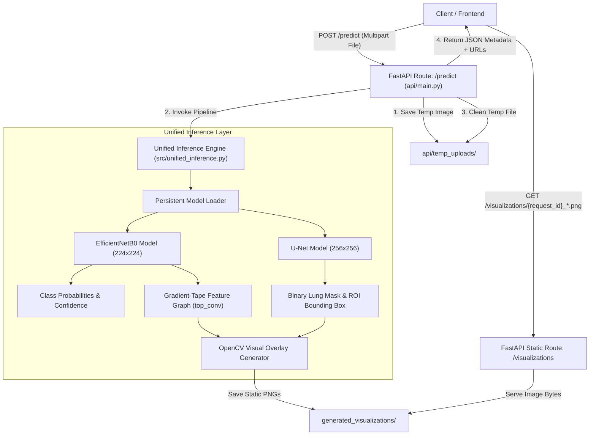
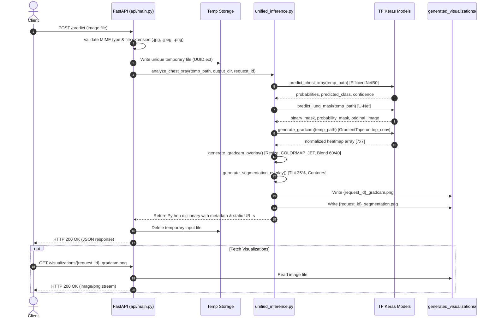

# System Architecture & Component Design

This document details the architectural principles, data flow, component interactions, and resource management strategies of the Chest X-Ray AI Analysis & Visualization platform.

---

## 🏛️ High-Level Architecture Overview

The system is structured as a layered, modular inference pipeline served by a FastAPI asynchronous web service.

---

## 🧩 Component Breakdown

### 1. Web Service Layer (`api/main.py`)
* **Framework:** FastAPI with Uvicorn ASGI server.
* **Responsibilities:**
  * Request validation (file type: JPG, JPEG, PNG; content-type checking).
  * Unique file session generation (`uuid.uuid4()`).
  * Temporary upload persistence to avoid in-memory streaming bottlenecks with large imaging tensors.
  * Delegating execution to `unified_inference.py`.
  * Converting NumPy data types to JSON-safe Python types via recursive `make_json_safe()`.
  * Mounting static file serving for generated PNG visualizations at `/visualizations`.
  * Temporary file cleanup in a `finally` block to guarantee no disk leakage for uploaded raw data.

### 2. Unified Inference Engine (`src/unified_inference.py`)
* **Role:** Single entrypoint module (`analyze_chest_xray`) orchestrating two separate deep learning models, explainability graph extraction, and visual rendering in a single execution pass.
* **Core Principles:**
  * **Zero Redundant Inference:** Intermediates (original image array, binary lung mask, Grad-CAM heatmap array) are captured directly during inference and reused for visualization rendering.
  * **Singleton Model Lifecycle:** TensorFlow `.keras` models are lazily loaded once on first invocation into module-level singletons (`classification_model`, `segmentation_model`) to eliminate repeated disk I/O and graph compilation latency.
  * **Isolated Model Inputs:** Classification and segmentation pipelines maintain dedicated preprocessing tailored to their training resolutions ($224 \times 224 \times 3$ RGB vs $256 \times 256 \times 1$ Grayscale).

### 3. Static Visualization Asset Layer (`generated_visualizations/`)
* **Role:** Storage directory for rendered visualization images.
* **Asset Lifecycle:**
  * Saved as standard uint8 PNG files using OpenCV (`cv2.imwrite`).
  * Named deterministically per inference request:
    * `{request_id}_gradcam.png`
    * `{request_id}_segmentation.png`
  * Served with caching headers through `fastapi.staticfiles.StaticFiles`.

---

## 🔄 End-to-End Request & Data Lifecycle

---

## 🔒 Thread Safety & Concurrency Considerations

1. **Model Loading:** The models are loaded in memory upon the first request or at startup. TensorFlow 2.x execution in Python is thread-safe for inference (`model.predict(..., verbose=0)` or `model(tensor)`).
2. **File Isolation:** Each request is assigned a distinct UUID v4 string for both temporary uploads and output visualization files. This eliminates race conditions during concurrent API requests.
3. **No Global State Mutations:** Prediction functions receive file paths and parameters explicitly and return discrete dictionary structures without mutating shared application state.
