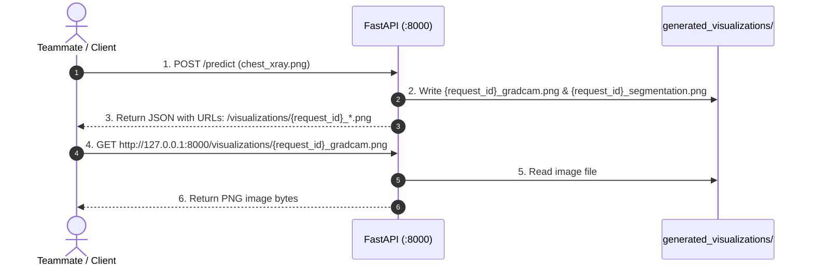

# How to Retrieve & View Generated Visualization Images

This guide explains how any teammate, client application, or frontend developer can retrieve, display, and download the visualization images generated by the Chest X-Ray AI API.

---

## 🎯 Overview of the Visualization System

When an image is submitted to `POST /predict`, the inference pipeline automatically renders two distinct visualization images and saves them as PNG files:
1. **Grad-CAM Explainability Overlay** (`{request_id}_gradcam.png`)
2. **Lung Segmentation Mask Overlay** (`{request_id}_segmentation.png`)

These files are stored in the project's `generated_visualizations/` directory and are immediately accessible over HTTP via the mounted static endpoint at `/visualizations/...`.

```
API Base URL: http://127.0.0.1:8000
Static Visualizations Route: http://127.0.0.1:8000/visualizations/
```

---

## 🔁 1. The Standard Workflow



### JSON Response Example
```json
{
  "success": true,
  "result": {
    "classification": { "predicted_class": "covid", "confidence": 0.9999 },
    "visualizations": {
      "gradcam_overlay_url": "/visualizations/a7804a59-cfde-4b72-b53f-d7c02406300f_gradcam.png",
      "segmentation_overlay_url": "/visualizations/a7804a59-cfde-4b72-b53f-d7c02406300f_segmentation.png"
    }
  }
}
```

---

## 🚀 2. Six Ways to Retrieve & View Images

### Method 1: In the Web Browser (Fastest for Visual Inspection)
Once the server is running, prepend the API host (`http://127.0.0.1:8000`) to the returned relative path:
* **Grad-CAM URL:** `http://127.0.0.1:8000/visualizations/a7804a59-cfde-4b72-b53f-d7c02406300f_gradcam.png`
* **Segmentation URL:** `http://127.0.0.1:8000/visualizations/a7804a59-cfde-4b72-b53f-d7c02406300f_segmentation.png`

Paste either URL directly into Chrome, Edge, Firefox, or Safari to view the image.

---

### Method 2: Through the Interactive Swagger UI (`/docs`)
1. Open your browser and navigate to: [http://127.0.0.1:8000/docs](http://127.0.0.1:8000/docs)
2. Expand the `POST /predict` endpoint.
3. Click **"Try it out"**.
4. Click **"Choose File"** and upload a chest X-ray image (`.jpg` or `.png`).
5. Click **"Execute"**.
6. Under the **Response body**, copy the `gradcam_overlay_url` or `segmentation_overlay_url` and open it in a new browser tab.

---

### Method 3: Using Python (Automated Download & Display)

Here is a ready-to-run script that sends an image, parses the visualization URLs, downloads the images, and displays them:

```python
import requests
from PIL import Image
from io import BytesIO

BASE_URL = "http://127.0.0.1:8000"
IMAGE_PATH = "chest_xray.png"

# 1. Send inference request
with open(IMAGE_PATH, "rb") as f:
    response = requests.post(
        f"{BASE_URL}/predict",
        files={"file": (IMAGE_PATH, f, "image/png")}
    )

data = response.json()
result = data["result"]

# 2. Extract visualization URLs
gradcam_url = f"{BASE_URL}{result['visualizations']['gradcam_overlay_url']}"
seg_url = f"{BASE_URL}{result['visualizations']['segmentation_overlay_url']}"

print("Grad-CAM URL:     ", gradcam_url)
print("Segmentation URL: ", seg_url)

# 3. Download and open images in memory
gradcam_response = requests.get(gradcam_url)
gradcam_img = Image.open(BytesIO(gradcam_response.content))
gradcam_img.show(title="Grad-CAM Overlay")

seg_response = requests.get(seg_url)
seg_img = Image.open(BytesIO(seg_response.content))
seg_img.show(title="Segmentation Overlay")

# 4. Optional: Save to local disk
gradcam_img.save("downloaded_gradcam.png")
seg_img.save("downloaded_segmentation.png")
print("[OK] Saved downloaded images to disk.")
```

---

### Method 4: Using cURL or PowerShell (CLI Download)

#### Using cURL (Bash / Command Prompt):
```bash
# 1. Run prediction and save JSON response
curl -X POST "http://127.0.0.1:8000/predict" \
     -F "file=@chest_xray.png" \
     -o response.json

# 2. Download the Grad-CAM image
curl -O "http://127.0.0.1:8000/visualizations/a7804a59-cfde-4b72-b53f-d7c02406300f_gradcam.png"

# 3. Download the Segmentation image
curl -O "http://127.0.0.1:8000/visualizations/a7804a59-cfde-4b72-b53f-d7c02406300f_segmentation.png"
```

#### Using PowerShell:
```powershell
# Upload image and get response
$response = Invoke-RestMethod -Uri "http://127.0.0.1:8000/predict" -Method Post -Form @{
    file = Get-Item -Path "chest_xray.png"
}

# Construct full URLs
$baseUrl = "http://127.0.0.1:8000"
$gradcamUrl = $baseUrl + $response.result.visualizations.gradcam_overlay_url
$segUrl = $baseUrl + $response.result.visualizations.segmentation_overlay_url

# Download images
Invoke-WebRequest -Uri $gradcamUrl -OutFile "downloaded_gradcam.png"
Invoke-WebRequest -Uri $segUrl -OutFile "downloaded_segmentation.png"
Write-Host "Visualizations downloaded successfully!"
```

---

### Method 5: In a Frontend Application (HTML / React / Vue)

Because the URLs are exposed as standard static endpoints, frontend web apps can render them directly with HTML `` tags:

```jsx
// React Component Example
function PredictionView({ predictionResult }) {
  const baseUrl = "http://127.0.0.1:8000";
  const { gradcam_overlay_url, segmentation_overlay_url } = predictionResult.visualizations;

  return (
    <div className="visualization-gallery">
      <div>
        <h3>Grad-CAM Heatmap</h3>
        
      </div>
      <div>
        <h3>Lung Segmentation Mask</h3>
        
      </div>
    </div>
  );
}
```

---

### Method 6: Direct Local File System Access

If you are running the API locally or working within the same workspace:
* All generated files are stored directly on disk in:
  `chest_xray_api/generated_visualizations/`
* Filename pattern:
  * `{request_id}_gradcam.png`
  * `{request_id}_segmentation.png`

You can open them directly with your system's image viewer or file explorer without making an HTTP request.

---

## ❓ Frequently Asked Questions & Troubleshooting

### Q: Why are the URLs relative (e.g. `/visualizations/...`) instead of absolute?
**A:** Returning relative URLs ensures compatibility when the server runs on different hosts, domain names, reverse proxies (like Nginx), or ports (e.g. `localhost:8000`, `api.hospital.org`, or `0.0.0.0:8000`) without hardcoding `http://127.0.0.1:8000`.

### Q: What if I get a 404 Not Found error when accessing an image URL?
**A:** Check the following:
1. Verify the FastAPI server is still running.
2. Confirm the URL starts with `/visualizations/` and matches the exact filename returned in the `/predict` JSON response.
3. Check the `generated_visualizations/` folder on disk to verify the file exists.
